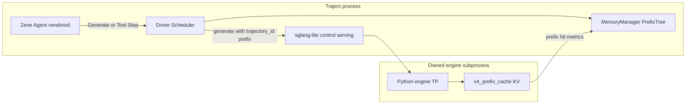

# 揉入 Zene + sglang-lite 执行计划

把 Zene agent crates 与 sglang-lite（Python 引擎 + Rust control/serving）整仓并入 Traject，打通 Trajectory 感知的推理路径，使 Inference 能跟踪并优化 agent session，而不再依赖外部 HTTP 黑盒。

状态：Phase A–D 已完成。Memory 对齐与 Driver 步进路径已实现；**pro6000（8× RTX PRO 6000）真机 e2e 已通过**（见 [e2e-pro6000.md](e2e-pro6000.md)）。

## 问题

当前形态曾是 **外部依赖 + HTTP 旁路**：Zene 经 OpenAI 打 sglang-lite `:8000`，`ChunkRequest.trajectory_id` / `prefix` 被忽略，Agent 绕过 `Driver` / `MemoryManager`。Inference 看不到 session，无法做跨 tool 步的 prefix / KV 优化。

## 选定形态（本阶段）

**仓库内自有、由 Traject 拥有并编排**；GPU 权重执行仍走 sglang-lite 的 Python 引擎子进程（已有 TP=8 / DeepSeek-V4 能力），但：

- 源码进 Traject 树，不再依赖 `~/project/sglang-lite` 或 `../zene`
- Agent 每步 LLM / Tool 进入同一 `Trajectory`
- 引擎协议携带 `trajectory_id` + prefix / session 句柄，与 [`MemoryManager`](../crates/traject-memory/src/manager.rs) 对齐

完整「Rust 同进程加载 MoE 权重」仍是后续 Phase（见 [roadmap.md](roadmap.md)），本阶段不改写整个 runner。

## Phase A — 源码并入仓库

**Zene（agent 栈，不含 cloud）**

- 将 `zene/crates/{config,core,sandbox,session,tools,llm,mcp}` 复制为 Traject workspace members：`crates/zene-*`（包名暂保留 `zene-*`）
- `crates/traject-zene` 改为 workspace 内依赖，去掉对外部 `../zene` 的 path
- 不引入 `zene/cloud`；Keel / sandbox 保持 “off” 默认以便 5090 集成跑通

**sglang-lite**

- 同步进 `third_party/sglang-lite/`：
  - `engine/` + `pyproject.toml`（Python 包）
  - Rust：`control`、`serving` 作为 workspace members（crate 名 `sglang-lite-control` / `sglang-lite-serving`）
- [`LocalEngineHandle`](../crates/traject-inference/src/backend/local_engine.rs) / [`scripts/start_engine.sh`](../scripts/start_engine.sh) 默认 `SGLANG_LITE_ROOT` 指向仓库内 `third_party/sglang-lite`

## Phase B — Agent 接到 Traject 调度主路径

- 改造 [`crates/traject-zene/src/runner.rs`](../crates/traject-zene/src/runner.rs)：不再让 `zene-llm` 直连外部 `base_url` 作为主路径
- 新增 `TrajectLlmProvider`（实现 zene `Provider`）：每次 `chat` 映射为同一 Trajectory 上的 `Generate` 步；tool 结果映射为 `Tool` 步并 `MemoryManager` pin / append
- `traject agent` 默认走引擎路径（`:9001`）；`--legacy-http` / tool-bridge 仅作兼容

## Phase C — Inference 侧 session / prefix 可见

- 扩展 [`ChunkRequest`](../crates/traject-inference/src/chunked.rs) → `SglangLiteEngineBackend` 请求体：带上 `trajectory_id`、`prefix_id`、`session_id`
- vendored `engine/` 的 generate 入口记录 session，并返回 `cache_hit_tokens` 写回 Trajectory / MemoryManager
- Agent 主路径优先 engine `/v1/generate`，不再经无状态 chat + tools 黑盒

## Phase D — 真机验收 ✅ (pro6000, 2026-08-06)

- 引擎 `:9001` TP=8 DeepSeek-V4-Flash，`bash scripts/start_engine.sh`
- `cargo build -p traject-cli --release`
- Simple generate + [`scripts/e2e_agent_5090.sh`](../scripts/e2e_agent_5090.sh)（Glob → Read 多步）
- 验收：
  - [x] `generate step via driver/scheduler` + `tool step via driver/scheduler`
  - [x] history 连续 Generate/Tool（agent: generate_steps=3, tool_steps=2, history_len=5）
  - [x] `sglang-lite generate finished` 带 trajectory/step id
  - [x] `cache_hit_tokens` 字段回传（数值常为 0：V4 hybrid 路径物理 hit 仍待加强）
- 细节：[e2e-pro6000.md](e2e-pro6000.md)

## 本阶段明确不做

- 不把完整 MoE runner 改写成纯 Rust 同进程
- 不 merge zene cloud / 多租户控制面
- 不删除 sglang-lite 原仓库；以 Traject 树内副本为唯一集成源

## 后续工作

- [x] 引擎 radix / KV 与 Traject `MemoryManager` 对齐（`engine_handle`、pin / 复用 / cache-hit / 淘汰评分）
- [x] Zene 每步完整走 `Driver` / `Scheduler`（`run_generate_step` / `run_external_tool_step`）
- [x] `--legacy-http` / tool-bridge 降为非默认兼容路径
- [x] 引擎侧 pin/free RPC + 物理 KV free（local `PagedKvPool` + sglang radix/V4）
- [x] 同进程权重 runner：embed/head + tokenizer + FlashInfer + **layer-0 attn**（见 [kernels.md](kernels.md)）
- [ ] 全层 MoE/MLA 同进程（生产仍 sglang-lite）
- [ ] 移除 legacy 路径
